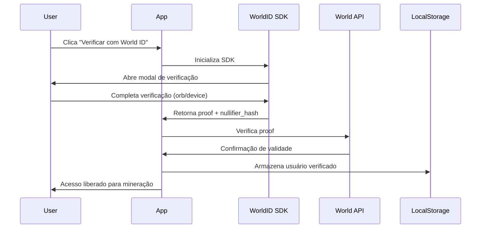

# Integração World ID - Fortex Mining App

## 📋 Visão Geral

Este documento descreve a integração completa do World ID no aplicativo Fortex, permitindo verificação de identidade única para mineração justa de tokens.

## 🔧 Configuração

### 1. Variáveis de Ambiente

Crie um arquivo `.env.local` na raiz do projeto:

```env
# World ID Configuration
NEXT_PUBLIC_WORLD_APP_ID=app_staging_xxxxxxxxxxxxxxxx
NEXT_PUBLIC_WORLD_ACTION_ID=fortex-mining

# Para produção, use seu App ID real do World Developer Portal
```

### 2. Obter Credenciais World ID

1. Acesse: https://developer.worldcoin.org
2. Crie uma conta de desenvolvedor
3. Registre um novo aplicativo "Fortex"
4. Copie o `App ID` e configure o `Action ID` como "fortex-mining"
5. Configure a URL de callback para seu domínio

## 🏗️ Arquitetura

### Componentes Principais

#### 1. **WorldIDProvider** (`src/components/world-id/WorldIDProvider.tsx`)
- Context Provider para gerenciar estado de autenticação
- Armazena dados do usuário verificado
- Fornece hooks `useWorldID()` para acesso global

#### 2. **WorldIDButton** (`src/components/world-id/WorldIDButton.tsx`)
- Botão de verificação interativo
- Carrega SDK do World ID dinamicamente
- Gerencia fluxo de verificação completo

#### 3. **WorldIDVerificationCard** (`src/components/world-id/WorldIDVerificationCard.tsx`)
- Card informativo sobre status de verificação
- Exibe detalhes do usuário verificado
- Integra botão de verificação

### Biblioteca Core

**`src/lib/world-id.ts`** - Funções utilitárias:
- `getWorldIDConfig()` - Configuração do ambiente
- `verifyWorldIDProof()` - Verificação de prova no backend
- `storeWorldIDUser()` - Armazenamento local do usuário
- `getWorldIDUser()` - Recuperação de dados do usuário
- `isUserVerified()` - Verificação de status

## 🔐 Fluxo de Verificação



## 💾 Armazenamento de Dados

### LocalStorage Schema

```typescript
// worldid_user
{
  "nullifierHash": "0x...",
  "verificationLevel": "orb" | "device",
  "verifiedAt": "2024-01-15T10:30:00.000Z",
  "isVerified": true
}
```

## 🚀 Uso nos Componentes

### Verificar Status de Autenticação

```typescript
import { useWorldID } from '@/components/world-id/WorldIDProvider';

function MyComponent() {
  const { user, isVerified, isLoading } = useWorldID();

  if (isLoading) return <div>Carregando...</div>;
  
  if (!isVerified) {
    return <WorldIDButton onSuccess={() => console.log('Verificado!')} />;
  }

  return <div>Bem-vindo, usuário verificado!</div>;
}
```

### Proteger Funcionalidades

```typescript
<MiningButton 
  disabled={!isVerified}
  isMining={miningData.isMining}
  onMiningUpdate={handleUpdate}
/>
```

## 🔒 Segurança

### Prevenção de Múltiplas Contas

- **Nullifier Hash**: Identificador único e anônimo por usuário
- **Proof Verification**: Validação criptográfica no backend
- **One-Time Use**: Cada verificação é única e não reutilizável

### Níveis de Verificação

1. **Orb** (Recomendado)
   - Verificação presencial com dispositivo Orb
   - Maior nível de segurança
   - Prova de humanidade garantida

2. **Device**
   - Verificação via smartphone
   - Nível intermediário de segurança
   - Mais acessível

## 📱 PWA e Mini App

### Configuração PWA

O arquivo `public/manifest.json` já está configurado:

```json
{
  "name": "Fortex Mining",
  "short_name": "Fortex",
  "start_url": "/",
  "display": "standalone",
  "background_color": "#1a1a1a",
  "theme_color": "#2B7FFF"
}
```

### Integração com World App

Para publicar como Mini App no World App:

1. **Build de Produção**
   ```bash
   npm run build
   ```

2. **Deploy**
   - Hospede em plataforma com HTTPS (Vercel, Netlify, etc.)
   - Configure domínio personalizado

3. **Registro no World Developer Portal**
   - Submeta URL do aplicativo
   - Configure permissões necessárias
   - Aguarde aprovação

## 🧪 Testes

### Ambiente de Staging

Use `app_staging_` prefix no App ID para testes:

```env
NEXT_PUBLIC_WORLD_APP_ID=app_staging_test123
```

### Simulação Local

Para desenvolvimento sem World ID real:

```typescript
// Modo de desenvolvimento (apenas para testes)
if (process.env.NODE_ENV === 'development') {
  // Simular usuário verificado
  localStorage.setItem('worldid_user', JSON.stringify({
    nullifierHash: '0xtest',
    verificationLevel: 'device',
    verifiedAt: new Date().toISOString(),
    isVerified: true
  }));
}
```

## 📊 Métricas e Analytics

### Eventos Rastreáveis

- `worldid_verification_started`
- `worldid_verification_success`
- `worldid_verification_failed`
- `mining_started_verified_user`
- `tokens_claimed_verified_user`

## 🐛 Troubleshooting

### SDK não carrega

```typescript
// Verificar se script foi carregado
if (!window.WorldID) {
  console.error('World ID SDK não disponível');
}
```

### Verificação falha

- Verifique App ID e Action ID
- Confirme que está usando HTTPS
- Verifique console para erros de CORS

### Dados não persistem

- Verifique se localStorage está habilitado
- Confirme que não está em modo privado/incógnito

## 🔄 Próximos Passos

1. ✅ Integração World ID completa
2. ⏳ Deploy em produção
3. ⏳ Registro no World Developer Portal
4. ⏳ Submissão como Mini App
5. ⏳ Implementação de smart contract ERC-20
6. ⏳ Integração com World Chain

## 📚 Recursos

- [World ID Documentation](https://docs.worldcoin.org/id)
- [Developer Portal](https://developer.worldcoin.org)
- [World App](https://worldcoin.org/download-app)
- [SDK Reference](https://docs.worldcoin.org/id/js)

## 🤝 Suporte

Para questões sobre integração World ID:
- Discord: https://discord.gg/worldcoin
- GitHub: https://github.com/worldcoin
- Email: developers@worldcoin.org
